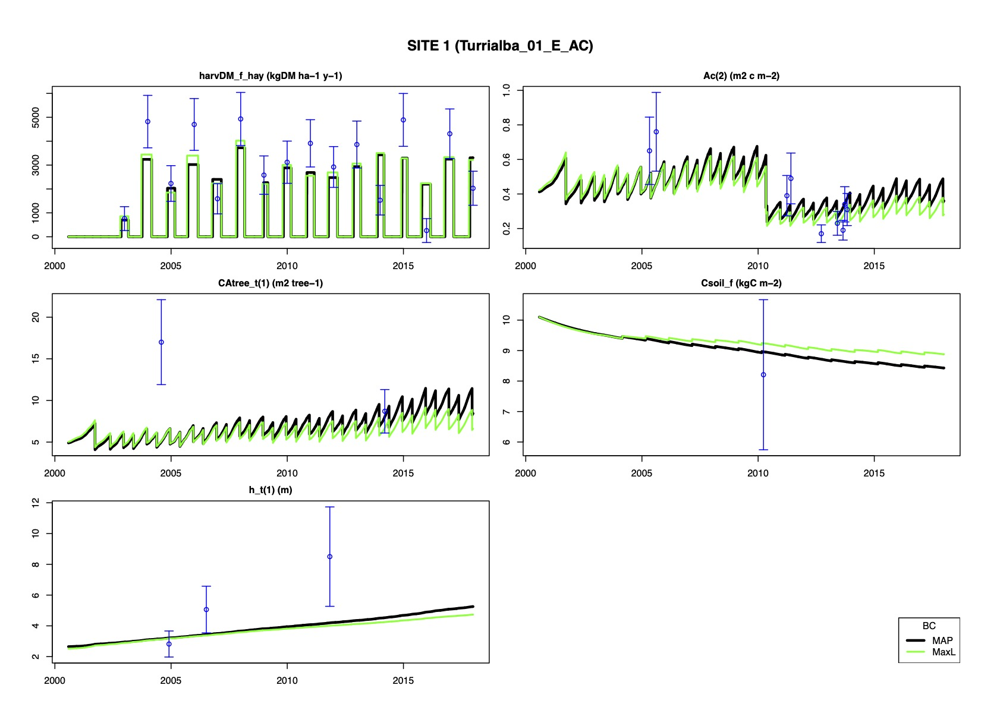

```{r, include=FALSE}
  knitr::opts_chunk$set(echo=F,results="asis",warning=FALSE,message=FALSE)
```


\clearpage

# Introduction

This report describes progress with process-based modelling of coffee agroforestry systems in Central America. We present the model CAF2021 which is an extension of the earlier models CAF2007 [@vanoijenPlotscaleModellingCoffee2009; @vanoijenCoffeeAgroforestrySystems2010a; @vanoijenCoffeeAgroforestrySystems2010] and CAF2014 [@Ovalle-Rivera_2020_Assessing]. Development and application of this model is part of project SEACAF under sub-contract B0554x4 which started at 17 March 2021. 

We began by thoroughly cleaning up model implementation in FORTRAN and R, to remove unnecessary legacy code and harmonise inconsistent variable and parameter names. The new naming conventions will not be described in this report but will be documented at a later stage, during phase four of this sub-contract. Likewise, we do not describe the structure of the model in great detail, but focus on how it differs from the earlier model versions including its capacity to simulate fruit trees and bienniality of coffee production. We reviewed the literature on banana (*Musa* spp.) and avocado (*Persea americana* Mill.) which are commonly used in Central America to produce fruits within coffee plantations [@Rice_2011_Fruits]. The literature review was intended to support parameterization of CAF2021 and we present its main results and preliminary model outputs for the two species.

So far, CAF2021 has only been calibrated against 18 different treatments from the long-term coffee agroforestry experiment by CATIE in Turrialba, Costa Rica. Some results from this calibration will be shown to illustrate the variety of shade tree compositions and output variables that the new model can simulate.

The report ends with a brief discussion of the next steps in CAF2021-modelling to be carried out in project SEACAF.


\clearpage

# CAF2021

The model simulates the biogeochemistry - the flows of carbon, nitrogen and water - of a coffee agroforestry system. Up to three shade tree species can be simulated. One of these can be an upper-layer timber tree, and two can be lower-layer service and/or fruit trees. The model simulates the height growth for each of the tree species but does not use that information to calculate shading patterns: upper-layer trees are always assumed to overshadow lower-layer trees, and all trees overshadow coffee.

The model uses a daily time step and therefore requires daily weather data (light, temperature, rain, wind, humidity) as input. Further required inputs are atmospheric [CO$_2$], soil properties (slope, water retention parameters, initial contents of C and N) and management calendars for fertilisation, pruning and thinning. The calendars can be specified separately for each plant species.

The model produces a wide variety of output variables, and a small selection is shown in the following table. They are the *land-cover variables Ac and At* from a simulation of a system with just one shade tree species, a service tree.

```{r}
  source("initialisation/initialise_CAF2021_Turrialba_01_E_AC.R")
  params <- set_par("TREEDENS0(1)",0.0325)
  output <- run_model()

  output_short <- signif( output, 3 )
  icols        <- 2:12
  knitr::kable( rbind( head(output_short[,icols],n=2),
                       rep("...",length(icols)),
                       tail(output_short[,icols],n=2,keepnums=F) ),
                col.names=outputNames[icols] )
```

The simulation ran from day 214 in year 2000 to day 365 in 2017, but the table only shows results for the first two days and the last two.

The variables At(1) .. At(3) represent fractional field coverage by the different tree species. We only have one tree species in this system so the values for At(2) and At(3) are all zeroes.

The variables Ac(1) .. Ac(6) represent the coverage by six different types of land-cover class within the field, each representing a different combination of tree species. Ac(1) is the fraction of the field where the coffee is not shaded at all, and Ac(2) is the fraction of the field exclusively shaded by tree species 1 (so without any upper-layer tree species above it). In this simple system, Ac(1) = 1 - Ac(2) = 1 - At(1).

The dynamics of shading becomes more complex the more tree species are being simulated. The next table shows what happens when we add an upper-layer tree species to the system.

```{r}
  source("initialisation/initialise_CAF2021_Turrialba_15_CE_AC.R")
  output <- run_model()

  output_short <- signif( output, 3 )
  icols        <- 2:12
  knitr::kable( rbind( head(output_short[,icols],n=2),
                       rep("...",length(icols)),
                       tail(output_short[,icols],n=2,keepnums=F) ),
                col.names=outputNames[icols] )
```

The table now shows positive entries for both At(1) representing the lower-layer service tree species, and At(3) representing the upper-layer timber tree. At(2) remains zero because we do not have a second lower-layer tree species.

There are four different combinations of shade tree presence covering this field: Ac(1) without trees, Ac(2) with only the lower-layer tree species, Ac(4) with only the upper-layer tree species, and Ac(5) with both tree species. If we would add a second lower-layer tree species, such as a fruit tree, we would also see positive vaues for Ac(3) representing coverage by that fruit tree species, and Ac(6) representing fruit + timber trees. An example of that is shown in Fig. \ref{fig:OutputsLCC}.

```{r OutputsLCC, fig.height=3.5, fig.cap="\\label{fig:OutputsLCC}Cumulative time series for the six land cover classes (LCC) in a coffee agroforestry system with three tree species."}
  source("initialisation/initialise_CAF2021_Turrialba_01_E_AC.R")
  params <- set_par(c("TREEDENS0(1)","TREEDENS0(2)","TREEDENS0(3)"),
                    c(0.01         ,0.0005         ,0.001         ) )
  output <- run_model()

  par( mfrow=c(1,1) )
  Time <- output[,1]
  i.Ac <- sapply( 1:6, function(i) {
    which( outputNames==paste0("Ac(",i,")") ) } )
  plot  ( Time, output[,i.Ac[1]], type="l", ylim=c(0,1),
          main="Cumulative ground cover of six LCC (-)",
          xlab="", ylab="" )
  points( Time, rowSums( output[,i.Ac[1:2]] ), type="l", col="yellow" )
  points( Time, rowSums( output[,i.Ac[1:3]] ), type="l", col="green" )
  points( Time, rowSums( output[,i.Ac[1:4]] ), type="l", col="red" )
  points( Time, rowSums( output[,i.Ac[1:5]] ), type="l", col="blue" )
  points( Time, rowSums( output[,i.Ac[1:6]] ), type="l", col="black" )
  legend( "bottomleft", cex=0.7, lty=1, bg="white",
          col=c("black","blue","red","green","yellow","black"),
          legend=c("+ LCC 6: Tree sp. 2+3",
                   "+ LCC 5: Tree sp. 1+3",
                   "+ LCC 4: Tree sp. 3",
                   "+ LCC 3: Tree sp. 2",
                   "+ LCC 2: Tree sp. 1",
                   "   LCC 1: Coffee full sun" ) )
```

## Model output variables

After each run of the model, all outputs are collected in a large matrix. The number of rows of the output-matrix equals the number of days in the simulated time period, and there as many columns as there are output variables. So for each output variable, the full time series can be analysed and plotted. We show some examples in Fig. \ref{fig:Outputs}.

```{r Outputs, fig.height=5, fig.cap="\\label{fig:Outputs}Selected outputs from CAF2021. Left: C in coffee, trees, soil. Right: Yield of beans and fruit."}
  source("initialisation/initialise_CAF2021_Turrialba_01_E_AC.R")
  params <- set_par(c("TREEDENS0(1)","TREEDENS0(2)","TREEDENS0(3)"),
                    c(0.01         ,0.0005         ,0.001         ) )
  output <- run_model()
  plot_output( vars=c("C_f"    , "harvDM_f_hay",
                      "CT_f"   , "harvCPT_f",
                      "Csoil_f" ) )
```

## Carbon-, nitrogen- and water-balances

For efficient post-processing of model output, we developed a suite of R-functions that calculate and plot biogeochemical balances, to assess whether the agroforestry system is a net source or sink of carbon, nitrogen and water.

```{r}
  plot_NbalanceSoil <- function( sim=output, title1="", title2=title1,
                                 ymax=NULL, verify=F ) {
    NinNames  <- c("Nfert_f", "NfixT_f", "NsenprunT_f", "Nsenprun_f")
    NoutNames <- c("Nleaching_f", "Nemission_f", "Nrunoff_f", "Nupt_f", "NuptT_f")
    nNin      <- length(NinNames) ; nNout  <- length(NoutNames)
    i.Nin     <- rep(NA,nNin)     ; i.Nout <- rep(NA,nNout)
    for(i in 1:nNin ) {i.Nin [i] <- which( outputNames==NinNames [i] ) }
    for(i in 1:nNout) {i.Nout[i] <- which( outputNames==NoutNames[i] ) }
    NinMean   <- colMeans(sim[,i.Nin])  * 1.e4 * 365 # kgN ha-1 y-1
    NoutMean  <- colMeans(sim[,i.Nout]) * 1.e4 * 365 # kgN ha-1 y-1
    if(is.null(ymax)) {
      y.max <- max( sum(NinMean), sum(NoutMean) )
    } else {
      y.max = ymax
    }
    leg <- NinNames
    barplot( as.matrix(NinMean),
             beside=F, ylim=c(0,y.max), col=1:length(leg),
             legend.text=leg,
             args.legend=list( title="Inputs (kg ha-1 y-1)", cex=0.8,
                               x="bottom", bg="white", inset=c(-0.3,0) ) )
    title(title1,adj=1)
    par(mar=c(3,0,3,3))
    leg <- NoutNames
    barplot( as.matrix(NoutMean),
             yaxt="n",
             beside=F, ylim=c(0,y.max), col=1:length(leg),
             legend.text=leg,
             args.legend=list( title="Outputs (kg ha-1 y-1)", cex=0.8,
                               x="bottom", bg="white", inset=c(-0.3,0) ) )
    title(title2,adj=0)
    if(verify) {
      Nsoil_f      <- sim[ , which( outputNames=="Nsoil_f") ] # kgN m-2
      D_Nsoil_f    <- Nsoil_f[NDAYS] - Nsoil_f[1]                # kgN m-2
      NinSum       <- colSums(sim[2:NDAYS,i.Nin ])            # kgN m-2
      NoutSum      <- colSums(sim[2:NDAYS,i.Nout])            # kgN m-2
      NinMinusNout <- sum(NinSum) - sum(NoutSum)
      cat( "VERIFYING THE N-BALANCE FOR THE SOIL (kgN m-2):",
           "\nState variable change: ", D_Nsoil_f,
           "\nInputs minus outputs : ", NinMinusNout )
    }
  }
```

```{r}
  plot_CbalanceSoil <- function( sim=output, title1="", title2=title1,
                                 ymax=NULL, verify=F ) {
    CinNames  <- c("CsenprunT_f", "Csenprun_f")
    CoutNames <- c("Rsoil_f", "Crunoff_f")
    nCin      <- length(CinNames) ; nCout  <- length(CoutNames)
    i.Cin     <- rep(NA,nCin)     ; i.Cout <- rep(NA,nCout)
    for(i in 1:nCin ) {i.Cin [i] <- which( outputNames==CinNames [i] ) }
    for(i in 1:nCout) {i.Cout[i] <- which( outputNames==CoutNames[i] ) }
    CinMean   <- colMeans(sim[,i.Cin])  * 1.e4 * 365 # kgC ha-1 y-1
    CoutMean  <- colMeans(sim[,i.Cout]) * 1.e4 * 365 # kgC ha-1 y-1
    if(is.null(ymax)) {
      y.max <- max( sum(CinMean), sum(CoutMean) )
    } else {
      y.max = ymax
    }
    leg <- CinNames
    barplot( as.matrix(CinMean),
             beside=F, ylim=c(0,y.max), col=1:length(leg),
             legend.text=leg,
             args.legend=list( title="Inputs (kg ha-1 y-1)", cex=0.8,
                               x="bottom", bg="white", inset=c(-0.3,0) ) )
    title(title1,adj=1)
    par(mar=c(3,0,3,3))
    leg <- CoutNames
    barplot( as.matrix(CoutMean),
             yaxt="n",
             beside=F, ylim=c(0,y.max), col=1:length(leg),
             legend.text=leg,
             args.legend=list( title="Outputs (kg ha-1 y-1)", cex=0.8,
                               x="bottom", bg="white", inset=c(-0.3,0) ) )
    title(title2,adj=0)
    if(verify) {
      Csoil_f   <- sim[ , which( outputNames=="Csoil_f") ] # kgC m-2 
      D_Csoil_f <- Csoil_f[NDAYS] - Csoil_f[1]                # kgC m-2
      CinSum        <- colSums(sim[2:NDAYS,i.Cin ])        # kgC m-2
      CoutSum       <- colSums(sim[2:NDAYS,i.Cout])        # kgC m-2
      CinMinusCout  <- sum(CinSum) - sum(CoutSum)
      cat( "VERIFYING THE C-BALANCE FOR THE SOIL (kgC m-2):",
           "\nState variable change: ", D_Csoil_f,
           "\nInputs minus outputs : ", CinMinusCout )
    }
  }
```

```{r, eval=F}
  par( mfrow=c(2,4) )
  par(mar=c(3,3,3,0))
  source("initialisation/initialise_CAF2021_Turrialba_01_E_AC.R")
  output <- run_model()
  plot_CbalanceSoil(output, title1="Soil C-balance: ", title2="Treatment 1", ymax=7500)
  par(mar=c(3,3,3,0))
  source("initialisation/initialise_CAF2021_Turrialba_02_E_MC.R")
  output <- run_model()
  plot_CbalanceSoil(output, title1="Soil C-balance: ", title2="Treatment 2", ymax=7500)
  par(mar=c(3,3,3,0))
  source("initialisation/initialise_CAF2021_Turrialba_03_E_MO.R")
  output <- run_model()
  plot_CbalanceSoil(output, title1="Soil C-balance: ", title2="Treatment 3", ymax=7500)
  par(mar=c(3,3,3,0))
  source("initialisation/initialise_CAF2021_Turrialba_04_E_BO.R")
  output <- run_model()
  plot_CbalanceSoil(output, title1="Soil C-balance: ", title2="Treatment 4", ymax=7500)
```

```{r}
  plot_H2ObalanceSoil <- function( sim=output, title1="", title2=title1,
                                   ymax=NULL, verify=F ) {
    WinNames  <- c("Rain_f")
    WoutNames <- c("Drain_f", "Runoff_f" , "Evap_f"    ,"Tran_f" , 
                   "TranT_f", "Rainint_f", "RainintT_f")
    nWin      <- length(WinNames) ; nWout  <- length(WoutNames)
    i.Win     <- rep(NA,nWin)     ; i.Wout <- rep(NA,nWout)
    for(i in 1:nWin ) {i.Win [i] <- which( outputNames==WinNames [i] ) }
    for(i in 1:nWout) {i.Wout[i] <- which( outputNames==WoutNames[i] ) }
    WinMean   <-    mean (sim[,i.Win])  # mm d-1
    WoutMean  <- colMeans(sim[,i.Wout]) # mm d-1
    if(is.null(ymax)) {
      y.max <- max( sum(WinMean), sum(WoutMean) )
    } else {
      y.max = ymax
    }
    leg <- WinNames
    barplot( as.matrix(WinMean),
             beside=F, ylim=c(0,y.max), col=1:length(leg),
             legend.text=leg,
             args.legend=list( title="Inputs (mm d-1)", cex=0.8,
                               x="bottom", bg="white", inset=c(-0.3,0) ) )
    title(title1,adj=1)
    par(mar=c(3,0,3,3))
    leg <- WoutNames
    barplot( as.matrix(WoutMean),
             yaxt="n",
             beside=F, ylim=c(0,y.max), col=1:length(leg),
             legend.text=leg,
             args.legend=list( title="Outputs (mm d-1)", cex=0.8,
                               x="bottom", bg="white", inset=c(-0.3,0) ) )
    title(title2,adj=0)
    if(verify) {
      WA_f   <- sim[ , which( outputNames=="WA_f") ] # mm
      D_WA_f <- WA_f[NDAYS] - WA_f[1]                   # mm
      WinSum        <-    sum (sim[2:NDAYS,i.Win ])  # mm
      WoutSum       <- colSums(sim[2:NDAYS,i.Wout])  # mm
      WinMinusWout  <- sum(WinSum) - sum(WoutSum)
      cat( "VERIFYING THE H2O-BALANCE FOR THE SOIL (mm):",
           "\nState variable change: ", D_WA_f,
           "\nInputs minus outputs : ", WinMinusWout )
    }
  }
```

```{r, eval=F}
  par( mfrow=c(2,4) )
  par(mar=c(3,3,3,0))
  source("initialisation/initialise_CAF2021_Turrialba_01_E_AC.R")
  output <- run_model()
  plot_H2ObalanceSoil(output, title1="Soil H2O-balance: ", title2="Treatment 1", ymax=8)
  par(mar=c(3,3,3,0))
  source("initialisation/initialise_CAF2021_Turrialba_02_E_MC.R")
  output <- run_model()
  plot_H2ObalanceSoil(output, title1="Soil H2O-balance: ", title2="Treatment 2", ymax=8)
  par(mar=c(3,3,3,0))
  source("initialisation/initialise_CAF2021_Turrialba_03_E_MO.R")
  output <- run_model()
  plot_H2ObalanceSoil(output, title1="Soil H2O-balance: ", title2="Treatment 3", ymax=8)
  par(mar=c(3,3,3,0))
  source("initialisation/initialise_CAF2021_Turrialba_04_E_BO.R")
  output <- run_model()
  plot_H2ObalanceSoil(output, title1="Soil H2O-balance: ", title2="Treatment 4", ymax=8)
```

```{r}
  plot_CbalanceCoffee <- function( sim=output, title1="", title2=title1,
                                   ymax=NULL, verify=F ) {
    CinNames  <- "gC_f"
    CoutNames <- c("dC_f", "prunC_f", "harvCP_f")
    nCin      <- length(CinNames) ; nCout  <- length(CoutNames)
    i.Cin     <- rep(NA,nCin)     ; i.Cout <- rep(NA,nCout)
    for(i in 1:nCin ) {i.Cin [i] <- which( outputNames==CinNames [i] ) }
    for(i in 1:nCout) {i.Cout[i] <- which( outputNames==CoutNames[i] ) }
    CinMean   <-    mean (sim[,i.Cin])  * 1.e4 * 365 # kgC ha-1 y-1
    CoutMean  <- colMeans(sim[,i.Cout]) * 1.e4 * 365 # kgC ha-1 y-1
    if(is.null(ymax)) {
      y.max <- max( sum(CinMean), sum(CoutMean) )
    } else {
      y.max = ymax
    }
    leg <- CinNames
    barplot( CinMean,
             beside=F, ylim=c(0,y.max), col=1:length(leg),
             legend.text=leg,
             args.legend=list( title="Inputs (kg ha-1 y-1)", cex=0.8,
                               x="bottom", bg="white", inset=c(-0.3,0) ) )
    title(title1,adj=1)
    par(mar=c(3,0,3,3))
    leg <- CoutNames
    barplot( as.matrix(CoutMean),
             yaxt="n",
             beside=F, ylim=c(0,y.max), col=1:length(leg),
             legend.text=leg,
             args.legend=list( title="Outputs (kg ha-1 y-1)", cex=0.8,
                               x="bottom", bg="white", inset=c(-0.3,0) ) )
    title(title2,adj=0)
    if(verify) {
      C_f          <- sim[ , which( outputNames=="C_f" ) ] # kgC m-2
      D_C_f        <- C_f[NDAYS] - C_f[1]                     # kgC m-2
      CinSum       <-    sum (sim[2:NDAYS,i.Cin ])         # kgC m-2
      CoutSum      <- colSums(sim[2:NDAYS,i.Cout])         # kgC m-2
      CinMinusCout <- sum(CinSum) - sum(CoutSum)
      cat( "VERIFYING THE C-BALANCE OF COFFEE (kgC m-2):",
           "\nState variable change: ", D_C_f,
           "\nInputs minus outputs : ", CinMinusCout )
    }
  }
```

```{r, eval=F}
  par( mfrow=c(2,4) )
  par(mar=c(3,3,3,0))
  source("initialisation/initialise_CAF2021_Turrialba_01_E_AC.R")
  output <- run_model()
  plot_CbalanceCoffee( output, title1="Coffee C-balance: ", title2="Treatment 1", ymax=6000)
  par(mar=c(3,3,3,0))
  source("initialisation/initialise_CAF2021_Turrialba_02_E_MC.R")
  output <- run_model()
  plot_CbalanceCoffee( output, title1="Coffee C-balance: ", title2="Treatment 2", ymax=6000)
  par(mar=c(3,3,3,0))
  source("initialisation/initialise_CAF2021_Turrialba_03_E_MO.R")
  output <- run_model()
  plot_CbalanceCoffee( output, title1="Coffee C-balance: ", title2="Treatment 3", ymax=6000)
  par(mar=c(3,3,3,0))
  source("initialisation/initialise_CAF2021_Turrialba_04_E_BO.R")
  output <- run_model()
  plot_CbalanceCoffee( output, title1="Coffee C-balance: ", title2="Treatment 4", ymax=6000)
```

```{r}
  plot_CbalanceSystem <- function( sim=output, title1="", title2=title1,
                                   ymax=NULL, verify=F ) {
    CinNames  <- c("gC_f"   , "gCT_f")
    CoutNames <- c("Rsoil_f", "Crunoff_f", "harvCP_f", "harvCPT_f", "harvCST_f")
    nCin      <- length(CinNames) ; nCout  <- length(CoutNames)
    i.Cin     <- rep(NA,nCin)     ; i.Cout <- rep(NA,nCout)
    for(i in 1:nCin ) {i.Cin [i] <- which( outputNames==CinNames [i] ) }
    for(i in 1:nCout) {i.Cout[i] <- which( outputNames==CoutNames[i] ) }
    CinMean   <- colMeans(sim[,i.Cin])  * 1.e4 * 365 # kgC ha-1 y-1
    CoutMean  <- colMeans(sim[,i.Cout]) * 1.e4 * 365 # kgC ha-1 y-1
    if(is.null(ymax)) {
      y.max <- max( sum(CinMean), sum(CoutMean) )
    } else {
      y.max = ymax
    }
    leg <- CinNames
    barplot( as.matrix(CinMean),
             beside=F, ylim=c(0,y.max), col=1:length(leg),
             legend.text=leg,
             args.legend=list( title="Inputs (kg ha-1 y-1)", cex=0.8,
                               x="bottom", bg="white", inset=c(-0.3,0) ) )
    title(title1,adj=1)
    par(mar=c(3,0,3,3))
    leg <- CoutNames
    barplot( as.matrix(CoutMean),
             yaxt="n",
             beside=F, ylim=c(0,y.max), col=1:length(leg),
             legend.text=leg,
             args.legend=list( title="Outputs (kg ha-1 y-1)", cex=0.8,
                               x="bottom", bg="white", inset=c(-0.3,0) ) )
    title(title2,adj=0)
    if(verify) {
      C_f      <- sim[ , which( outputNames=="C_f" )    ] # kgC m-2
      CT_f     <- sim[ , which( outputNames=="CT_f")    ] # kgC m-2
      Csoil_f  <- sim[ , which( outputNames=="Csoil_f") ] # kgC m-2 
      Csys_f   <- C_f + CT_f + Csoil_f                       # kgC m-2
      D_Csys_f <- Csys_f[NDAYS] - Csys_f[1]                  # kgC m-2
      CinSum       <- colSums(sim[2:NDAYS,i.Cin ])        # kgC m-2
      CoutSum      <- colSums(sim[2:NDAYS,i.Cout])        # kgC m-2
      CinMinusCout <- sum(CinSum) - sum(CoutSum)
      cat( "VERIFYING THE C-BALANCE FOR THE SYSTEM (kgC m-2):",
           "\nState variable change: ", D_Csys_f,
           "\nInputs minus outputs : ", CinMinusCout )
    }
  }
```

```{r, eval=F}
  par( mfrow=c(2,4) )
  par( mar=c(3,3,3,0) )
  source("initialisation/initialise_CAF2021_Turrialba_01_E_AC.R")
  output <- run_model()
  plot_CbalanceSystem(output, title1="System C-balance: ", title2="Treatment 1", ymax=11000)
  par( mar=c(3,3,3,0) )
  source("initialisation/initialise_CAF2021_Turrialba_02_E_MC.R")
  output <- run_model()
  plot_CbalanceSystem(output, title1="System C-balance: ", title2="Treatment 2", ymax=11000)
  par( mar=c(3,3,3,0) )
  source("initialisation/initialise_CAF2021_Turrialba_03_E_MO.R")
  output <- run_model()
  plot_CbalanceSystem(output, title1="System C-balance: ", title2="Treatment 3", ymax=11000)
  par( mar=c(3,3,3,0) )
  source("initialisation/initialise_CAF2021_Turrialba_04_E_BO.R")
  output <- run_model()
  plot_CbalanceSystem(output, title1="System C-balance: ", title2="Treatment 4", ymax=11000)
```

Biogeochemical balances can be calculated for the soil, the coffee plants, the trees, or the whole system. Four examples are shown in Fig. \ref{fig:Balances}.

```{r Balances, fig.height=6, fig.cap="\\label{fig:Balances}Biogeochemical balances for nitrogen, carbon and water. Left bar from each pair: gains; right bar: losses. All rates are averages for the whole period of simulation."}
  source("initialisation/initialise_CAF2021_Turrialba_01_E_AC.R")
  output <- run_model()
  par( mar=c(3,3,3,0), mfrow=c(2,4) )
  plot_NbalanceSoil  (output, title1="Soil N-balance"  , title2="")
  par( mar=c(3,3,3,0) )
  plot_CbalanceSoil  (output, title1="Soil C-balance"  , title2="")
  par( mar=c(3,3,3,0) )
  plot_H2ObalanceSoil(output, title1="Soil H2O-balance", title2="")
  par( mar=c(3,3,3,0) )
  plot_CbalanceSystem(output, title1="System C-balance", title2="")
```

Three of the balances in Fig. \ref{fig:Balances} are for the soil, and one is for the system overall. In each pair of barplots, the left one indicates input processes and the right one the outputs.

The soil $N$-balance shows four different processes that add nitrogen to the soil, of which fertilisation is the largest here, followed by pruning and senescence of coffee, $N$-fixation by service trees, and pruning and senescence of trees. There are five processes that remove $N$ from the soil of which leaching and uptake by the plants are the largest with emission and runoff being much smaller. Likewise, in the soil and system  $C$-balances, loss of carbon in runoff is negligible compared to soil respiration. Note that in this example some loss of carbon from the system is through harvesting of coffee beans and tree fruits.

The balances help us analyse which processes contribute most to gains and losses of $C$, $N$ and $H_2O$. The plots also show at a glance for which elements the soil or system suffers a net loss. In this arbitrary example, the $N$- and $C$-balances are nearly in equilibrium, but there is a net carbon gain. This will be mainly in the form of standing carbon of coffee plants and shade trees, which are not clearcut at the end of the simulation.

The balances are particularly useful when comparing different treatments. Fig. \ref{fig:Nbalance4Nlevels}, for example, shows how the soil N-balance is affected by N-fertilisation ranging from high (Treatment 1) to low (2, 3) or zero (4). We see that reducing fertilisation slows down most input- and output-processes, but not to the same degree such that the system suffers a net loss of nitrogen at the two lowest fertilisation levels.

```{r Nbalance4Nlevels, fig.height=6, fig.cap="\\label{fig:Nbalance4Nlevels}Soil nitrogen balances for 4 different levels of fertilisation. Gains on the left, losses on the right. The fertilisation levels decrease from Treatment 1 to 4 as can be seen from the black parts of the gains."}
  par( mfrow=c(2,4) )
  par(mar=c(3,3,3,0))
  source("initialisation/initialise_CAF2021_Turrialba_01_E_AC.R")
  output <- run_model()
  plot_NbalanceSoil(output, title1="Soil N-balance: ", title2="Treatment 1", ymax=800)
  par(mar=c(3,3,3,0))
  source("initialisation/initialise_CAF2021_Turrialba_02_E_MC.R")
  output <- run_model()
  plot_NbalanceSoil(output, title1="Soil N-balance: ", title2="Treatment 2", ymax=800)
  par(mar=c(3,3,3,0))
  source("initialisation/initialise_CAF2021_Turrialba_03_E_MO.R")
  output <- run_model()
  plot_NbalanceSoil(output, title1="Soil N-balance: ", title2="Treatment 3", ymax=800)
  par(mar=c(3,3,3,0))
  source("initialisation/initialise_CAF2021_Turrialba_04_E_BO.R")
  output <- run_model()
  plot_NbalanceSoil(output, title1="Soil N-balance: ", title2="Treatment 4", ymax=800)
```


\clearpage

# Bayesian calibration for Turrialba

CAF2021 was calibrated using data from the long-term experiment at CATIE, Turrialba, Costa Rica. A total of 18 of the experimental treatments can be simulated by the model (i.e. all treatments except those with two upper-level timber tree species). The model was calibrated for all these treatments in a single calibration assuming that soil and coffee parameters were the same across the whole experiment, and tree parameters could differ between species but not between treatments.

```{r}
  plot_CdistributionCoffee <- function( sim=output ) {
    Time <- sim[,1]
    i.CP <- which( outputNames=="CP_f" ) ; CP <- sim[,i.CP]
    i.CL <- which( outputNames=="CL_f" ) ; CL <- sim[,i.CL]
    i.CW <- which( outputNames=="CW_f" ) ; CW <- sim[,i.CW]
    i.CR <- which( outputNames=="CR_f" ) ; CR <- sim[,i.CR]
    plot( Time, CR+CW+CL+CP,
          main="Carbon in coffee (kg C m-2)",
          xlab="", ylab="", type="l", ylim=c(0,max(CR+CW+CL+CP)) )
    points( Time, CR+CW+CL, type="l", col="yellow" )
    points( Time, CR+CW   , type="l", col="green" )
    points( Time, CR      , type="l", col="red" )
    legend( "bottom", cex=0.7, lty=1, bg="white",
            col=c("black","yellow","green","red"),
            legend=c("+ CP: Beans",
                     "+ CL: Leaves",
                     "+ CW: Wood",
                     "   CR: Roots" ) )
  }

  plot_CdistributionTrees <- function( sim=output, it=1:3 ) {
    Time <- sim[,1]
    i.CPT <- sapply( 1:3, function(i){which( outputNames==paste0("CPT_t(",i,")"))} )
    i.CLT <- sapply( 1:3, function(i){which( outputNames==paste0("CLT_t(",i,")"))} )
    i.CBT <- sapply( 1:3, function(i){which( outputNames==paste0("CBT_t(",i,")"))} )
    i.CST <- sapply( 1:3, function(i){which( outputNames==paste0("CST_t(",i,")"))} )
    i.CRT <- sapply( 1:3, function(i){which( outputNames==paste0("CRT_t(",i,")"))} )
    for(t in it) {
      CPT   <- sim[,i.CPT[t]] ; CLT <- sim[,i.CLT[t]] ; CBT <- sim[,i.CBT[t]]
      CST   <- sim[,i.CST[t]] ; CRT <- sim[,i.CRT[t]]
      y.max <- max(CRT+CST+CBT+CLT+CPT)
      plot( Time, CRT+CST+CBT+CLT+CPT, ylim=c(0,y.max),
            main=paste0("Carbon in tree sp. ",it," (kg C m-2)"),
            xlab="", ylab="", type="l" )
      points( Time, CRT+CST+CBT+CLT, type="l", col="yellow" )
      points( Time, CRT+CST+CBT    , type="l", col="green"  )
      points( Time, CRT+CST        , type="l", col="red"    )
      points( Time, CRT            , type="l", col="blue"   )
      legend( "bottom", cex=0.7, lty=1, bg="white",
              col=c("black","yellow","green","red","blue"),
              legend=c("+ CPT: Fruits",
                       "+ CLT: Leaves",
                       "+ CBT: Branches",
                       "+ CST: Stems",
                       "   CRT: Roots" ) )
    }
  }
```

Fig. \ref{fig:averageYields} shows that observed variation of coffee production in the 18 simulated treatments of the CATIE experiment was explained well by CAF2021 after the joint calibration, albeit with some underestimation of the absolute yield levels.

```{r averageYields, fig.height=3.5, fig.cap="\\label{fig:averageYields}Average annual yields for the 18 treatments: simulations vs. observations."}
# After running a BC
  load('BC/BC_2021-04-28_1e5/BC_04_56.RData')
  source('BC/BC_averageYields.R')
```

```{r}
  s <- 1 # Choose a site from those for which the BC was carried out
  params_BC_MAP   <- scparMAP_BC  * sc
  params          <- list_params        [[s]] ; matrix_weather <- list_matrix_weather[[s]]
  calendar_fert   <- list_calendar_fert [[s]] ; calendar_prunC <- list_calendar_prunC[[s]] 
  calendar_prunT  <- list_calendar_prunT[[s]] ; calendar_thinT <- list_calendar_thinT[[s]]  
  NDAYS           <- list_NDAYS         [[s]]       
  ip_BC_s         <- ip_BC_site         [[s]]
  icol_pChain_s   <- icol_pChain_site   [[s]]
# Calculate model output for the MAP parameter vector
  params[ip_BC_s] <- params_BC_MAP      [icol_pChain_s]
  params.MAP         <- params
  matrix_weather.MAP <- matrix_weather
  calendar_fert.MAP  <- calendar_fert
  calendar_prunC.MAP <- calendar_prunC
  calendar_prunT.MAP <- calendar_prunT
  calendar_thinT.MAP <- calendar_thinT
  NDAYS.MAP          <- NDAYS
  source('initialisation/initialise_CAF2021_Turrialba_20_PS_MC.R')
  output <- run_model( params, matrix_weather, calendar_fert, calendar_prunC,
                     calendar_prunT, calendar_thinT, NDAYS )
  output.MAP <- run_model( params.MAP, matrix_weather.MAP,
                           calendar_fert.MAP, calendar_prunC.MAP,
                           calendar_prunT.MAP, calendar_thinT.MAP, NDAYS.MAP )
```

```{r, eval=F}
  plot_output( list_output=list(output.MAP),
               vars       =c( "fTran(1)"    , "fNgrowth(1)", "DVS(1)"  ,
                              "SINKP(1)"    , "DayFl(1)"   , "PARMA(1)" ,
                              "harvDM_f_hay", "CT_f" ) )
```

Fig. \ref{fig:BCsite1} shows, for the example of treatment 1, all the calibration data and the corresponding simulations results when running the model with two different parameter vectors: the MAP and the maximum likelihood estimate.

```{r BCsite1, out.width="500px", fig.cap="\\label{BCsite1}Turrialba treatment 1 (Erythrina poeppigiana, high fertilisation): simulations using the MAP and maximum-likelihood parameter vectors. Blue circles: observations."}

```


\clearpage

# Bienniality

CAF2021 simulates plant physiology and morphology in a simplified manner. Biennial production in coffee, where high- and low-yield years alternate, is simulated with an empirical function that makes bean sink strength inversely proportional to its value in the preceding year. Bean sink strength is also reduced when the coffee plants are heavily shaded to mimic the consequences of less intensive flowering under such conditions. Fig. \ref{fig:SINKP} shows that this approach leads to more stable production over the years in the shaded part of a field than in the sun part. Shade trees thus provide some yield stability in CAF2021.

Biennial production as observed in the CATIE experiment used for Bayesian calibration can be simulated reasonably well with this approach. One example of this is the time series of simulated and observed coffee production shown in Fig. \ref{fig:BCsite1}.

Various alternative methods to induce bienniality in the model have been tried with so far little success. One of these was to simulate next year's bean sink strength as a state variable that slowly increases from zero in the current year at a rate that is inversely proportional to water and nitrogen stress. So any year in which bean growth is severely limited by stress would be followed by a year with extra bean sink strength. However, calibration of this method and others on the Turrialba data did not produce stably simulated bienniality.

We therefore continue with the current simple method but aim to test it against data from other locations when they become available.

```{r SINKP, fig.height=3.5, fig.cap="\\label{fig:SINKP}Simulation of coffee with one shade tree species. Top row: bean sink strength on (1) unshaded and (2) shaded parts of the field. Bottom: average annual bean production for the whole field."}
  source("initialisation/initialise_CAF2021_Turrialba_01_E_AC.R")
  calendar_thinT[ 1, , ] <- -1
  output <- run_model()
  plot_output(vars=c( "SINKP(1)" ,  "SINKP(2)", "harvDM_f_hay") )

  # calendar_thinT[ 1, 1, ] <- c( 2002, 124, 1 ) # Clear-cutting shade trees!
  # output <- run_model()
  # plot_output(vars=c( "fTran(1)", "fNgrowth(1)",
  #                     "DVS(1)"  , "SINKP(1)" , "SINKPMAXnew(1)",
  #                     "DayFl(1)", "PARMA(1)", "harvDM_f_hay") )
  # plot_output(vars=c( "fTran(2)", "fNgrowth(2)",
  #                     "DVS(2)"  , "SINKP(2)" , "SINKPMAXnew(2)",
  #                     "DayFl(2)", "PARMA(2)", "Ac(1)") )
```


\clearpage

# Modelling fruit trees

As described above, CAF2021 can simulate up to three tree species. In previous model versions, the only services the trees could provide were timber production, N-fixation, soil organic matter production (from senescence and pruning), C-sequestration and erosion prevention. To these we now added the possibility to produce fruits. In a typical use of the model, fruit production will be limited to one or two of the lower-layer tree species, but CAF2021 can simulate reproductive growth of the upper layer too if needed.

The inclusion of fruit trees in the model does increase the demand for data, as we need to parameterise fruit growth (C and N) and harvesting. So far, we only searched the literature for information on banana and avocado which are the two most prominent fruit producing species in Guatemala and (together with citrus) in Costa Rica.

## Banana

Banana is a herb, not a tree, and it does not have woody tissues. Banana has a pseudostem from which the leaves grow, and no true stems or branches. Despite these differences, CAF2021 simulates banana with the same algorithms as for regular trees. So even for banana, the model simulates the growth of 'stems' (S) and 'branches' (B) but together they represent what in banana is the pseudostem plus rhizome (or 'corm'). In this way it remains possible to simulate the morphology of the banana plant with the tree allometric functions, where height is a function of S and crown area a function of B.

Banana plants are not synchronized so there is fruit production throughout the year. We therefore do not simulate any seasonal phenology, but fruit production does depend on the availability of light, water and nitrogen which may vary through the year.

### Pre-existing models

More complex methods of modelling banana exist. One example is the model SIMBA [@Blazy_2010_BANAD; @Damour_2012_Simulation; @Ripoche_2012_Modeling; @Tixier_2008_SIMBA.]. This model simulates the population dynamics of banana leaves, bunches and fingers in too great detail to be used as an example for CAF2021, but some parameter values used by the SIMBA-modellers can be used by CAF2021, such as a base temperature of 14 $^{\circ}$C, an SLA of 0.018 $m^2 g^{-1}$, light extinction coefficient = 0.7, LAI up to 3.5 and leaf N-content 3-4% of DM.

A simpler process-based model was proposed for plantain in Colombia by @ChavesC._2009_Modeling. Unfortunately their model's parameterisation and calibration data are partly implausible with an extremely low light extinction coefficient of 0.2817 and the LAI exceeding 12.9 (with observations even going up to 15). More realistic are their values for the LUE (1.63 g MJ-1) and the critical temperatures of $T_{min}$ = 12.5 $^{\circ}$C, $T_{opt}$ = 25 $^{\circ}$C, $T_{max}$ = 40 $^{\circ}$C. In their model, aboveground allocation during the vegetative stage is about equally to leaves, pseudostem and corm (all about 1/3). During the reproductive stage, leaves did nor grow anymore, the corm lost mass, the pseudostem kept growing slowly, but the majority of allocation went to fruits. At the end of their experiment, bunch dry matter was 45% of the aboveground total.

An empirical temperature- and rainfall-dependent banana model based on EcoCrop was proposed by [@VanDenBergh_2012_Climate]. Their model used the following critical monthly tempreatures: $T_{kill}$ = 0 $^{\circ}$C, $T_{min}$ = 12 $^{\circ}$C, $T_{opt}$ = 17.5 to 26.3 $^{\circ}$C, $T_{max}$ = 33 $^{\circ}$C.

@Landry_2017_foliar simulated growth of banana and expansion of black leaf streak disease caused by *Mycosphaerella fijiensis*. Their banana submodel focuses on leaf number and position which is incompatible with the biogeochemical approach taken in CAF2021.

### Empirical literature

Several authors have made inventories of agroforestry systems in Central America that include banana:

- @Cerda_2020_Coffee identified six coffee agroforestry systems as the "most promising ones for reducing losses [by pests and diseases] while simultaneously providing other ecosystem services [e.g. C-sequestration]". In their preferred systems, the density of Musaceae ranged from 0-1400 $ha^{-1}$ (mean 216 $ha^{-1}$). Total shade from all tree spp. (service, fruit, timber) did not surpass 35%.
- @Bellamy_2013_Banana: registered 400 banana-plants per hectare in a coffee plantation in Costa Rica.
- @Dold_2007_Musa held interviews with farmers in the Turrialba region. The most common coffee agroforestry systems were coffee + poro (*Erythrina peoppigiana*) + banana/plantain (most common at 30% banana 'Gros Michel') + laurel (*Cordia alliodora*). Typical tree densities were 162 poro $ha^{-1}$, 179 banana/plantain $ha^{-1}$, 37 laurel $ha^{-1}$. They cite literature where poro density is 130-208 $ha^{-1}$ and banana 149-343 $ha^{-1}$ and state that banana above 120 $ha^{-1}$ would reduce coffee yield too much.
- @Dold_2010_Improving found that in central Costa Rica, the mean plant density was 4244 coffee $ha^{-1}$, 341 trees $ha^{-1}$, and 579 bananas $ha^{-1}$. In northern Nicaragua the mean plant densities were 4852 coffee plants $ha^{-1}$, 185 trees $ha^{-1}$, and 358 bananas $ha^{-1}$. Thirteen different banana cultivars were identified, of which 91% were from the subgroup AAA 'Gros Michel' and AAA 'Cavendish' in Costa Rica, and 97% were from AAA 'Gros Michel' and the AAA 'Red' subgroup in Nicaragua.
- @Rice_2011_Fruits: Guatemalan coffee farmers most often mentioned banana as their primary fruit tree in coffee fields (36% of respondents), followed by avocado (26%).
- @Staver_2013_Intercropping inventoried the presence of banana in coffee agroforestry systems in Central America and Peru. 'Gros Michel' was the most-used banana cultivar. Banana planting density ranged from 300 to 600 $ha^{-1}$, and trees (mainly poro and *Inga* spp.) from 150 to 550 $ha^{-1}$.

Parameter values were reported by the following authors:

- @GalvisR._2013_Effect reported that SLA decreased from initially high values of 150 decreasing to 100 m2 g-1, but these are impossibly high values.
- @Jullien_2001_Withinbunch reported that pulp DMP reaches asymptotically to values of about 30%. 
- @Mustaffa_2012_Banana: leaf N content was about 3% of DM.
- @MartinezAcosta_2011_Dinamica reported for the final DM per tree, bunch:leaves:pseudostem+corm: 3000:1200:1800 g DM.
- @Schaffer_1999_Atmospheric give DM-partitioning of 6-month old vegetative banana (cv. 'Gros Michel'): leaves:pseudostem+rhizome:roots =  19:64:19%.
- DM-partitioning of cv. 'Williams' in Colombia was not affected strongly by the level of N-fertilization (0 to 483 kg N $ha^{-1}$), but fruit yields increased from 9 to 12 kg DM [@TorresB._2014_Accumulation]. At harvest after 161 kg N $ha^{-1}$ fertilization: corm+pseudostem/leaves/fruits = 6/1.5/3.5 kg DM per plant. Total plant N-concentration was 1-1.5% of DM.
- @Turner_2007_Environmental: LAI ranges from 2 to 5 m2 m-2.

### Banana simulation in CAF2021

To make CAF2021 simulate banana in a coffee plantation, we start by initialising for a full-sun coffee system, then set the initial density of fruit trees (TREEDENS0(2)) to a positive value, and choose parameter settings that are appropriate for banana. We show some preliminary results in Fig. \ref{fig:SimBanana}.

```{r}
  source("initialisation/initialise_CAF2021_Turrialba_19_PS_AC.R")
  params <- set_par( "TREEDENS0(2)"                            , 0.04       )
  params <- set_par( c("CBtree0","CLtree0","CRtree0","CStree0"), rep(1,4)   )
  params <- set_par( c("FWT(2)","FST(2)","FPT(2)")             , rep(0.5,3) )
  params <- set_par( "TBEFOREPT(2)"                            , 100        )
  params <- set_par( c("TCBT(2)","TCRT(2)","TCST(2)")          , rep(365,3) )
  params <- set_par( c("KH(2)","KAC(2)")                       , c(4,6)     )
  output <- run_model()
```

```{r SimBanana, fig.height=3.5, fig.cap="\\label{fig:SimBanana}Simulating banana with CAF2021."}
  par( mfrow=c(2,3), mar=c(3,3,3,3) )
  
  plot_CdistributionTrees(it=2)
  
  Time <- output[,1]
    i.ht2    <- which( outputNames=="h_t(2)" )       ; h_t2      <- output[,i.ht2]
    i.Ac1    <- which( outputNames=="Ac(1)" )        ; Ac1       <- output[,i.Ac1]
    i.CAt2   <- which( outputNames=="CAtree_t(2)" )  ; CAtree2   <- output[,i.CAt2]
    i.CPT    <- which( outputNames=="harvCPT_f" )    ; harvCPT_f <- output[,i.CPT]
    YtreesDM <- harvCPT_f * 1e4 * 365 / 0.45
  plot( Time, h_t2     , type="l", ylab="", main="Height (m)" )
  plot( Time, CAtree2  , type="l", ylab="", main="Crown area (m2 tree-1)" )
  plot( Time, 1-Ac1    , type="l", ylab="", main="Shade (-)" )
  plot( Time, YtreesDM , type="l", ylab="", main="Fruit yield (kg DM ha-1)" )
```

## Avocado

In contrast to banana, avocado is a true woody tree. No pre-existing models avocado were found in the literature.

### Empirical literature

The literature on avocado is extensive. Below, we list the main papers of use for model parameterisation that we identified, for all of which pdf-files have been collected. Because avocado is highly sensitive to its growing conditions, the literature needs to be used with care as much of the research has been carried out outside the tropics (especially the United States and South Africa) and reported parameter values may not be applicable elsewhere.

NITROGEN

- @Lovatt_1996_Nitrogen: N percentage and DMP (dry matter percentage) in fruits and leaves of cultivar Hass.
- For more on N uptake and partitioning, see http://geisseler.ucdavis.edu/Guidelines/N_Avocado.html
- @Atucha_2012_Groundcover: foliar N and runoff N (and carbon C).
- @Bar_1987_Seasonal: 'Seasonal changes in nitrogen concentration in avocado leaves associated with leaf age and fertilisation regime'.
- @Barcenas-Ortega_2003_Contenido: "Figura 1. Contenido de nitrógeno en hojas, flor y fruto de aguacate cultivar Hass en Uruapan, Mich".
- @Dixon_2008_Leaf: comparing [N] recommendations from different references.
- @Bender_2015_Avocadoa Table 1 on p. 34 (ref. Cutting 2000) gives a high value of 0.54% (dry weight basis) for [N] of leaves.
- @Mickelbart_2007_Effects: foliar N (cultivar Hass on 10 rootstocks in California): 2.1-2.4 % of DM.
- @Gil_2012_Effect, 4 yr old Hass:
  - [N]roots: 1.52-2.00 % 
  - [N]wood: 0.90-1.16 % 
  - [N]shoots: 2.12-2.26 % 
  - [N]leaves: 2.58-3.22 % 
- @Henao-Rojas_2019_Fruit, cultivar Hass in Colombia: [N]fruit = 6.6-9.9 g kg-1 (median 8.8).
- @Hermoso_2003_Comportamiento, Hass on two rootstocks in Spain: [N]leaves = 1.87-1.96 % of DM.
- @Kaneko_2016_Water, Hass in New Zealand: [N]leaves = 2.78% of DM (control), 2.46% (drought).
- @Rosecrance_2002_Seasonal and @Rosecrance_2003_Seasonal: DM and N distribution within 20-yr old Hass.
- @Yumpu.com_2002_Manejo: N-fertilisation and impact on yield.

LIGHT EXTINCTION

- @Hadari_2004_ThreeDimensional give curves of fractional light (I/I0) and cumulative LAI with distance (m) from the top of the canopy. Using these to stimate the light extinction coefficient as -ln(I/I0)/LAI leads to values 0.6-0.7.

DRY MATTER ALLOCATION AND DISTRIBUTION & PHENOLOGY

- @Adar_1999_Annual: data on allocation and dry matter percentage through the year.
- @Arpaia_1994_Development: California shoot growth mainly in 1 or 2 flushes (always summer, sometimes spring), root growth more constant through most of the year, but no vegetative growth in winter.
- @Bonomelli_2019_Effect: 2-yr old tree DM partitioning 0.30:0.45:0.25 for roots:wood:shoots.
- @Cossio-Vargas_2011_Vegetative: Mexico, calendars of flowering and vegetative flushed for cultivars Hass & Fuerte.
- @Cossio-Vargas_2008_Fenologia:
  - Two commercial ‘Hass’ avocado orchards, Nayarit, México.
  - "two flushes of vegetative growth: winter (greatest intensity) and summer (lowest intensity)."
  - "The complete floral development process, from closed pointed bud to anthesis, required 11.5 and 7.5 months for winter and summer shoots, respectively."
  - "Greatest production of roots occurred in August."
  - "Fruit growth (length), from set (March) to harvest (November), took eight months."
- @Gil_2012_Effect: 4 yr old Hass DM %: wood:shoots:leaves:roots = 22:15:30:33.
- @Howden_2005_Climate: Higher T leads to earlier maturity and smaller fruit. Elevated $CO_2$ benefits fruit set and retention while it changes allocation in favour of trunks.
- @Rocha-Arroyo_2011_Phenology, Mexico (Michoacán): "Hass avocado showed three vegetative flushes: winter (higher intensity), spring and summer (lower intensity), two root production flushes and three to four flowering flushes."
- @Rosecrance_2002_Seasonal and @Rosecrance_2003_Seasonal: DM and N distribution within 20-yr old Hass.
- @Sanclemente_2014_Pruning: DM distribution in 2-yr old Choquette: very roughly L:S:R = 0.4:0.3:0.3
- @Schaffer_1999_Atmospheric: Hass DM distribution Old leaves : New leaves : Old branches : New Branches : Trunk : Roots = 550 : 900 : 500 : 200 : 550 : 2000 g. Elevated $CO_2$ roots +30%.
- @Trochoulias_1991_Dry: Distribution of DM in 13-yr old Fuerte tree of 478.5 kg DM at full flowering in 10 different organs. Blossoms 3%, leaves 9%, branches (3 classes) 24%, 'Scaffold limbs' 32%, trunk 11%, roots (4 classes) 22%.

ROOT GROWTH

- @Atucha_2013_Root: vertical soil profile showed that rooting is shallow.
- @Atucha_2012_Groundcover: root life span first quartile: 110 days (< 0.2 mm), 168 days (> 0.2 mm). Life span shorter in top soil layer.

SENESCENCE

- @Bernal-Estrada_2020_Dynamics: Leaf turnover 2600 - 7600 kg leaf DM ha-1 y-1, over whole year but rates higher in dry period.
- @Carr_2014_Advances: Leaves last for 10-12 months.

MORPHOLOGY

- @Cantuarias-Aviles_2019_Water: Canopy 'volume', calculated as $4/3 \, \pi \, height/2 \, width/2$ was 40 - 115 $m^3$.
- @Mickelbart_2007_Effects: Hass in California on 10 different rootstocks at age 10 yrs: tree height 5.5 m, tree width 4.3-5.2 m.
- @Chartzoulakis_2002_Water; SLW (2 yr old Hass in Chania, Greece): 8.12 (watered) - 6.17 (stressed) $mg \, cm^{-2}$. [SLA in $m^2 \, kg^{-1}$ $C_{leaf}$ is 1/SLW x 100/0.45, so for watered this would be 27.4 and for stressed 36.0 $m^2 kg^{-1} C$.]
- @Doupis_2017_Growth: 2 yr old Hass in Chania, Greece: total leaf DM 50 g, total leaf area 0.5 $m^2$. [So SLA is 10 $m^2 \, kg^{-1}$ DM or about 10/0.45 = 22 $m^2 \, kg^{-1}$ C*. Both DM and area about 40% less with waterlogging.
- @Acosta-Rangel_2018_Evaluation: SLA of Hass was 83.4 $cm^2 g^{-1}$ DM = 8.34 $m^2 \, kg^{-1}$ DM or 8.34 / 0.45 = 18.5 $m^2 \, kg^{-1}$ $C_{leaf}$. Wood density (sapwood only, no bark or phloem) of Hass was 0.32 $g \, cm^{-3}$ [= 320 $kg \, m^{-3}$ or 320 x 0.45 = 144 $kgC \, m^{-3}$].
- @Finazzo_1990_Assimilate: 10-yr old cv. Peterson: SLW 9-13 $mg \, cm^{-2}$, so slightly larger than the 2 yr old Hass of @Chartzoulakis_2002_Water.
- @Gil_2012_Effect: (from reported leaf DM and area, and using 0.45 $kg \, C \, kg^{-1} DM$): SLA 13-29 $m^2 kg^{-1} C$ (variation between soil texture classes).
- @Schaffer_1987_Effect, 8-yr old cv. 'Booth 7' in Florida: lower values of SLW: 3 (leaves on branches with fruit) to 4 (without) $mg \, DM \, cm^{-2}$, i.e. SLA = 33 to 25 $m^2 \, kg^{-1}$ DM and thus about 70 to 55 $m^2 \, kg^{-1}$ C.
- @Mazhawu_2019_Water and @Mazhawu_2020_Water, cultivar Hass in South Africa, 4 x 7 m spacing, tree height 3.8 m (5 yrs old) increasing to 7.4 m (12 yrs), with LAI increasing from 2.95 $m^2 m^{-2}$ to 4.75, and ground cover increasing from 43 to 92% (the latter after heavy pruning back to 55%).
- @Wu_2018_Estimating: 2-yr old trees: 3.6-3.7 m, leaf area 40-42 $m^2$. same trees much larger a year later (3-yr old): 5.0-5.2 m, 102-123 $m^2$.

YIELD

- @Mickelbart_2007_Effects: Alternate bearing with yield in off-years on average 28% of that in on-years.
- Avocado production in Mexico is year-round [@CIRAD_2019_Country]. Yield ramps up from 0.3-1.6 t ha-1 at age 4 to 12-15 t ha-1 at age 7-8 and older.
- @GobiernoSalvadoreno_2018_Guia, El Salvador. Hass at 1000 to 2000 m altitude. Harvest months vary with altitude ('low' = 1000-1600 m, 'medium' = 1600-2000 m, 'high' = over 2000 m):
     - Low: Principal: 4-6, Loca: 12-3
     - Medium: Principal: 11-2, Loca: 7-10
     - High: Principal: 12-3, Loca: 8-9
- @Lobell_2006_Impacts, California: Productive life of avocado orchards: 30 years (first harvest at age 3, full production from age 7 yrs).
- @Whiley_2013_Literature: review of causes of irregular bearing.

ROOT GROWTH

- @Carr_2014_Advances: Mexico: rooting depth 1.2-1.4 m. 21-42 % in top 20 cm, 65-83% in top 60 cm. Horizontal spread 2.5-3. South Africa: up to about double those Mexican values for depth and spread. More references are discussed.

WATER RELATIONS

- @Carr_2014_Advances: Stomata start closing at leaf water potential < -0.4 MPa, fully closed at -1.0 to -1.2 MPa.
- @Holzapfel_2017_Responses: Yield increased when irrigation esnured that water avilability was more than 75% of demand (potential ET) and reduced bienniality (i.e. yield in off years was increased relatively more than that in on years).
- @Kaneko_2016_Water: "Kc [= the crop water use coefficient] of avocado in summer is generally between 0.4 and 0.6, but it is also location specific (Carr 2013). For example, in summer, standard Kc in California is 0.50-0.55, whereas Kc in Israel is 0.60-0.65 (Lahav et al. 2013)."
- @Mazhawu_2020_Water, Hass in South Africa: monthly crop water use 20 - 110% of ET0.
- @Oster_2007_Salinity: drainage of irrigation water.

SHADING

- @Coelho_2010_Nivel: Coffee (3333 ha-1) AFS with Inga edulis (308 ha-1) and avocado (175 ha-1) in Brazil: Shading 82.3-89.5%, Self-shading coffee 61.4-69.6% (in monoculture more 73.9-95.8%).

BIOGEOCHEMISTRY

- @Kiggundu_2012_Water, Florida, young trees of cv Simmonds: N-leaching about 10% of fertilization.

### Avocado simulation in CAF2021

To make CAF2021 simulate avocado in a coffee plantation, we proceed as for banana. So we start by initialising a full-sun system, then set the density of fruit trees (TREEDENS(2)) to a positive value, and choose parameter settings that are appropriate for avocado.

Compared with banana, avocado:

- has lower planting density of 200 $ha^{-1}$. CAF2021-parameter TREEDENS0(2) = 0.02.
- has a considerable delay (4-7 years) to first fruit production. CAF2021-parameter TBEFOREPT = 1825.
- has similarly small trees. CAF2021-parameters KH(2) = 4, KAC(2) = 6.
- is a true tree species with woody plant parts and roots that senesce much more slowly than the pseudostem and roots of banana. Some stem senescence is still simulated for avocado to mimic the common practice of pruning the trees to keep their height within convenient levels for harvesting. CAF2021-parameters TCRT(2) = TCST(2) = TCBT(2) = 1000.
- has similar allocation pattern (but with true stems and branches instead of rhizomes and pseudostems). CAF2021-parameters FWT(2) = 0.5, FST(2) = 0.5, FPT(2) = 0.5.
- is more seasonal than banana (but much less than coffee). Often two to three vegetative flushes and long harvest periods. But the harvesting occurs throughout the year which we simulate as for banana by means of a constant low-intensity harvesting. This allows us to keep CAF2021 simple without the need for simulating flowering and fruit set phenology for any trees.

We show some preliminary results for avocado simulation in Fig. \ref{fig:SimAvocado}.

```{r SimAvocado, fig.height=3.5, fig.cap="\\label{fig:SimAvocado}Simulating avocado with CAF2021."}
  source("initialisation/initialise_CAF2021_Turrialba_19_PS_AC.R")
  params <- set_par( "TREEDENS0(2)"                            , 0.02       )
  params <- set_par( c("FWT(2)","FST(2)","FPT(2)")             , rep(0.5,3) )
  params <- set_par( "TBEFOREPT(2)"                            , 1825       )
  params <- set_par( c("TCBT(2)","TCRT(2)","TCST(2)")          , c(1000,1000,1000) )
  params <- set_par( c("KH(2)","KAC(2)")                       , c(4,6)     )
  output <- run_model()

  par( mfrow=c(2,3), mar=c(3,3,3,3) )
  
  plot_CdistributionTrees(it=2)
  
  Time <- output[,1]
    i.ht2    <- which( outputNames=="h_t(2)" )       ; h_t2      <- output[,i.ht2]
    i.Ac1    <- which( outputNames=="Ac(1)" )        ; Ac1       <- output[,i.Ac1]
    i.CAt2   <- which( outputNames=="CAtree_t(2)" )  ; CAtree2   <- output[,i.CAt2]
    i.CPT    <- which( outputNames=="harvCPT_f" )    ; harvCPT_f <- output[,i.CPT]
    YtreesDM <- harvCPT_f * 1e4 * 365 / 0.45
  plot( Time, h_t2     , type="l", ylab="", main="Height (m)" )
  plot( Time, CAtree2  , type="l", ylab="", main="Crown area (m2 tree-1)" )
  plot( Time, 1-Ac1    , type="l", ylab="", main="Shade (-)" )
  plot( Time, YtreesDM , type="l", ylab="", main="Fruit yield (kg DM ha-1)" )
```


\clearpage

# Discussion and outlook

This report concludes the development of the structure of the CAF2021 model in project SEACAF. Further model development is not planned for the near future, unless major errors are identified when the model is confronted with a wider range of observations.

According to the workplan for sub-contract B0554x4 of project SEACAF, the next steps in the work on CAF2021 will be:

- Bayesian calibration of the model using data from Nicaragua and Guatemala. This widening of the calibration data base is highly important to ensure that model applicability extends beyond the Turrialba region of Costa Rica. Likewise, data on growth and productivity of banana, avocado and other shade trees in Central American coffee agroforestry systems would be very useful.
- Application of the model to the farms surveyed in project SEACAF. This will require reliable model input data (weather, soil, management) for each farm, and would benefit from knowledge of average coffee and tree productivity levels in Costa Rica and Guatemala.
- Posting the model, with full documentation, in a public repository on GitHub. We have already put CAF2021 on GitHub, but in a private repository where it will remain until model documentation is finalised.
- Presentation of the model to colleagues, training them in model use.
- Publication of modelling results.
  
  
  
  
<br>  
<br>  
<br>  
<br>  
<br>  
<br>  
<br>  
<br>  
  
# Acknowledgements {-}

I thank the Natural Resources Institute of the University of Greenwich for funding, and my colleagues in project SEACAF and earlier projects for their interest and for sharing their knowledge and understanding of coffee agroforestry.


\clearpage

# References {-}
